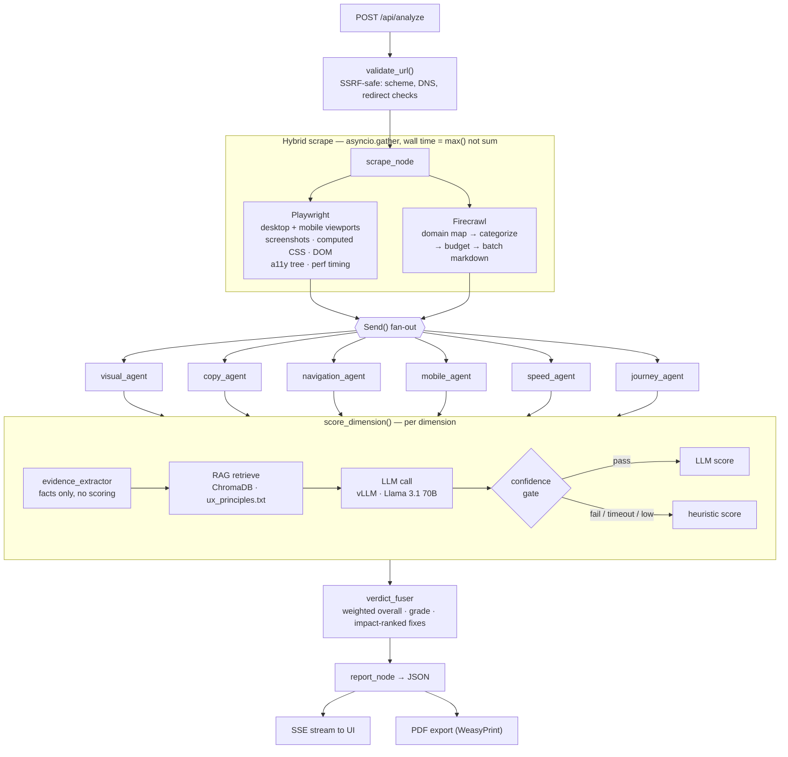

# Critiq — Brand DNA & UX Analyzer

**Paste a URL. Get a structured brand identity profile and a weighted, evidence-grounded UX audit in about three minutes.**


A UX audit today is a consultant with a checklist: expensive, slow, and inconsistent between reviewers. Critiq automates the mechanical 80% of that review. It renders the target site in a real browser (desktop *and* mobile), extracts hard signals — color clusters, font stacks, WCAG contrast ratios, DOM structure, tap-target geometry, readability, performance timing — then has six agents score 14 weighted UX dimensions through an LLM grounded in a retrieval corpus of published UX research (NN/g, Baymard, CXL, WCAG 2.1). Every dimension has a deterministic heuristic fallback, so a flaky LLM endpoint degrades the report's depth instead of breaking it.

```
https://stripe.com  →  hybrid scrape  →  6 parallel agents  →  RAG-grounded scoring  →  88/100 (A-) + PDF
```

---

## Screenshots

Every screenshot below is a real run against `https://stripe.com/` — 5 pages, 163.5s, scored **88/100 (A-)**.


<table>
  <tr>
    <td width="50%"><br /><sub><b>Landing</b> — paste any URL</sub></td>
    <td width="50%"><br /><sub><b>Same page, light theme</b> — full parity throughout</sub></td>
  </tr>
  <tr>
    <td width="50%"><br /><sub><b>Brand DNA</b> — palette extracted by K-Means over the render</sub></td>
    <td width="50%"><br /><sub><b>Visual Structure</b> — layout pattern, hierarchy, personality</sub></td>
  </tr>
  <tr>
    <td width="50%"><br /><sub><b>Dimension Radar</b> — all 14 scored dimensions</sub></td>
    <td width="50%"><br /><sub><b>Same radar, light theme</b></sub></td>
  </tr>
  <tr>
    <td width="50%"><br /><sub><b>Static Analysis</b> — tone, Flesch score, per-dimension cards with weights</sub></td>
    <td width="50%"><br /><sub><b>Top Fixes</b> — ranked by weight × deficit, with evidence</sub></td>
  </tr>
</table>

> The Top Fixes panel shows what "grounded" means in practice: *"7 buttons above the fold — competing CTAs dilute focus"* is a counted fact from the DOM, not a generated observation. Note also the honest `No forms detected (dimension partially skipped)` on Form UX Quality.

---

## The problem

A brand or UX audit is one of the most repeatedly-performed pieces of work in the design industry, and one of the least systematized:

- **Agencies and freelancers** re-do the same first-pass review for every prospect — screenshot the site, eyeball the palette, note the contrast failures, count the CTAs above the fold. It is billable-hour work that produces near-identical artifacts each time.
- **Founders and marketers** get told their landing page "doesn't convert" with no structured breakdown of *which* of the dozen contributing factors is actually weakest, or which one is worth fixing first.
- **Reviewer variance is the real cost.** Two consultants auditing the same page disagree on both what's wrong and how badly — because nothing anchors the judgment to a shared rubric.

Existing tools split the problem and solve half of it. Lighthouse and axe audit *machine-checkable* properties (performance, contrast ratios, ARIA) and say nothing about value proposition, tone, or brand coherence. Generic "ask an LLM about my website" tools do the opposite — fluent prose with no measured evidence behind it, no weighting, and no reproducibility.

Critiq closes the gap by grounding both halves: hard signals extracted from a real browser render, judged against a fixed rubric retrieved from a UX-research corpus, with fixed impact weights so the priority ordering is reproducible rather than vibes.

| | |
|---|---|
| Full audit on a 5-page site | **163.5s** end to end (measured on `stripe.com`) |
| Dimensions scored per report | **14** weighted, each with retrieved grounding context |
| Consultant equivalent | `[ADD METRIC]` — hours saved per first-pass audit |
| Reviewer variance | Eliminated for the scored dimensions — same rubric, same weights, every run |

---

## Use cases

| Scenario | How the system handles it |
|---|---|
| An agency runs a prospective client's site before a pitch call | Submits the URL, gets a graded report in ~3 minutes with the top 5 fixes ranked by impact — the pitch deck writes itself from the Top Fixes section |
| A founder wants to know why their SaaS landing page underperforms | The `saas` site-type profile boosts Value Proposition, Above-the-Fold Density, and Journey weights; the report surfaces which of those is actually dragging the score |
| A designer needs to justify a redesign to stakeholders | Exports the PDF: a scored before-state with contrast failures, CTA counts, and readability grade level cited as evidence, not opinion |
| A team wants to check brand consistency after a rebrand | The Brand DNA tab extracts the live palette (K-Means over rendered screenshots), font stacks, layout pattern, and detected tone — comparable against the intended brand guide |
| A dev checks mobile before shipping | The scrape runs a mobile viewport in parallel with desktop; tap-target sizing and responsive behavior are scored as first-class dimensions, not an afterthought |

---

## Architecture

Orchestration is a [LangGraph](https://github.com/langchain-ai/langgraph) `StateGraph`. `scrape_node` runs once, then `Send()` fans state out to six agents that execute concurrently and write into a shared `AnalysisState` through a custom reducer that merges each agent's partial score dicts. Fusion and report assembly run after the join.



Per-dimension scoring lives in `chains/rag_chain.py`, written as an explicit retrieve → prompt → call → validate chain over ChromaDB and an OpenAI-compatible client, without a hard dependency on the `langchain` package.

### Engineering decisions worth mentioning

**Evidence extraction is separated from scoring.** `services/evidence_extractor.py` returns structured facts — trust-signal matches, CTA counts, contrast ratios, tap-target dimensions — and does no scoring at all. The LLM judges *facts*, never the heuristic's guess. Without this split the LLM anchors on whatever number the heuristic already produced and the two stop being independent signals.

**The pipeline assumes the LLM will fail.** Shared-infra vLLM endpoints time out, rate-limit, and return malformed JSON. `llm_client.py` layers retries with exponential backoff, a circuit breaker that stops retrying after 3 consecutive same-type failures, a token-bucket rate limiter (28 req/60s), and a concurrency semaphore. Above that, every dimension has a confidence gate with a deterministic heuristic fallback. The design target is a report that always ships, with per-dimension honesty about which score is which.

**Scraping is hybrid because the two engines have opposite cost curves.** Playwright gives browser-identical signals (computed CSS, accessibility tree, performance timing) but is expensive per page; Firecrawl maps and scrapes the rest of the domain cheaply as markdown. They run under one `asyncio.gather`, so total wall time is `max()`, not the sum. Firecrawl failure is downgraded to a warning and the run continues on Playwright's internal-link crawl.

**Weights adapt to site type.** A trust badge matters more on an ecommerce checkout than on a portfolio. `SITE_TYPE_BOOSTS` in `services/ux_scorer.py` applies per-type weight boosts (ecommerce → trust signals, form UX, CTA; saas → value prop, above-fold; media → scanability, typography; and so on) so the priority ranking reflects what actually converts for that category.

**Progress is pushed, not polled.** `services/job_events.py` is an in-process pub/sub; the background pipeline publishes agent-level events and `routes/stream.py` forwards them over SSE. The frontend timeline reflects real agent state rather than a fake progress bar over a 3-minute request.

---

## Tech stack

| Layer | Technology | Why |
|---|---|---|
| API | FastAPI + Uvicorn | Async-native — the whole pipeline is `asyncio`, and SSE streaming is first-class |
| Orchestration | LangGraph `StateGraph` | `Send()` fan-out with a custom state reducer models parallel agents better than hand-rolled `gather` + merge |
| Scoring chain | Custom RAG chain (`chains/rag_chain.py`) | Retrieve → prompt → call → validate, explicit and debuggable, without the `langchain` dependency surface |
| Vector store | ChromaDB (embedded) | The UX corpus is one file and rarely changes — an embedded store beats operating a vector DB service |
| LLM | Self-hosted vLLM, Llama 3.1 70B Instruct | Zero per-token cost on a 15–20-call-per-report workload; OpenAI-compatible so Groq is a two-env-var swap |
| Rendering | Playwright (Chromium) | Only a real browser yields computed CSS, the a11y tree, and honest mobile-viewport behavior |
| Site crawl | Firecrawl | Domain map + clean markdown for supporting pages at a fraction of Playwright's per-page cost |
| Visual analysis | scikit-learn (K-Means) + Pillow | Palette extraction as color clustering over the rendered screenshot, not CSS declarations that may never paint |
| Copy analysis | spaCy + textstat | Deterministic readability and entity extraction — no reason to spend an LLM call on Flesch score |
| Persistence | SQLAlchemy + SQLite | Jobs and reports are low-volume, single-node; SQLite removes an entire piece of deployment |
| PDF | WeasyPrint | HTML/CSS templating reuses the report markup instead of a second rendering path |
| Frontend | React 19 + TypeScript + Vite | React Compiler enabled via Babel plugin; Vite for the dev loop |
| State | Zustand | Two small stores (analysis, UI/theme) — Redux ceremony would exceed the state |
| UI | Tailwind CSS, Framer Motion, Recharts | Utility styling with full light/dark parity; Recharts for the dimension radar |
| Live updates | Server-Sent Events | One-directional server→client progress; WebSockets would be bidirectional overhead for nothing |

---

## Project structure

```
brand-dna-analyzer/
├── backend/
│   ├── main.py                      # FastAPI app, CORS, route registration
│   ├── database.py                  # SQLAlchemy engine + session factory
│   │
│   ├── graph/
│   │   ├── pipeline.py              # LangGraph StateGraph — pipeline definition
│   │   └── state.py                 # Shared AnalysisState schema + reducers
│   │
│   ├── agents/                      # One module per graph node
│   │   ├── scrape_node.py
│   │   ├── visual_agent.py          # Palette, fonts, contrast, layout, personality
│   │   ├── copy_agent.py            # Readability, keywords, CTAs, tone, value prop
│   │   ├── navigation_agent.py      # Nav structure, form UX, trust signals
│   │   ├── mobile_agent.py          # Tap targets, responsive behavior
│   │   ├── speed_agent.py           # Lighthouse-driven, heuristic fallback
│   │   ├── journey_agent.py         # Conversion-flow lens on first impression / AFD / trust
│   │   ├── verdict_fuser.py         # Weighted fusion + impact-ranked priority fixes
│   │   └── report_node.py           # Final report assembly
│   │
│   ├── chains/rag_chain.py          # RAG-grounded per-dimension LLM scoring
│   ├── scoring/score_fusion.py      # Weighted score aggregation
│   │
│   ├── services/
│   │   ├── scraper.py               # Playwright homepage scraper
│   │   ├── scraper_orchestrator.py  # Hybrid scrape, parallel + fallback
│   │   ├── evidence_extractor.py    # Fact extraction (no scoring)
│   │   ├── visual_extractor.py      # Palette, fonts, contrast, layout signals
│   │   ├── copy_analyzer.py         # Readability, keywords, CTAs, structure
│   │   ├── ux_scorer.py             # 20 dimension definitions, weights, heuristics
│   │   ├── llm_client.py            # Retries, circuit breaker, rate limit, semaphore
│   │   ├── job_events.py            # In-process pub/sub feeding the SSE stream
│   │   ├── report_builder.py        # Final JSON report assembly
│   │   └── pdf_generator.py         # WeasyPrint PDF export
│   │
│   ├── scraper/lighthouse_runner.py # Lighthouse CLI wrapper
│   ├── knowledge_base/
│   │   ├── ux_principles.txt        # The RAG corpus — 20 dimensions, ~800 lines
│   │   ├── build_kb.py              # Chunk + embed into ChromaDB
│   │   └── chroma_db/               # Generated, gitignored
│   │
│   ├── data_collection/build_brand_dataset.py   # 500-brand screenshot scraper
│   ├── caption_screenshots.py                   # Gemini captioning → Florence-2 training JSON
│   │
│   ├── models/                      # SQLAlchemy + Pydantic schemas
│   ├── routes/                      # analyze · jobs · reports · stream
│   └── utils/                       # URL validation, text cleaning, color math
│
├── frontend/src/
│   ├── pages/                       # HomePage · AnalysisPage · ReportPage
│   ├── components/                  # landing · analysis · report · ui primitives
│   ├── store/                       # Zustand stores
│   ├── hooks/useSSEStream.ts        # Live progress
│   └── api/                         # REST client
│
└── docs/backend-architecture.md     # Deep-dive on scraping/analysis internals
```

---

## Getting started

### Prerequisites

- Python 3.12+
- Node.js 20+
- Chromium for Playwright (`playwright install chromium`)
- An LLM endpoint — a self-hosted [vLLM](https://github.com/vllm-project/vllm) server running Llama 3.1 70B Instruct (intended backend), or a [Groq](https://groq.com) key as a drop-in. **Neither is strictly required**: the pipeline runs end to end on heuristic scoring alone.

Optional:
- [Firecrawl](https://www.firecrawl.dev) API key — site-wide page discovery (see [Known limitations](#known-limitations))
- [Lighthouse CLI](https://www.npmjs.com/package/lighthouse) (`npm i -g lighthouse`) — real page-speed audits; falls back to heuristics

### Backend

```bash
cd backend
python -m venv venv
venv\Scripts\activate          # macOS/Linux: source venv/bin/activate
pip install -r requirements.txt
playwright install chromium
python -m spacy download en_core_web_sm
python knowledge_base/build_kb.py
uvicorn main:app --reload --port 8000
```

### Frontend

```bash
cd frontend
npm install
npm run dev
```

Open `http://localhost:5173`, paste a URL, and watch the six agents run live.

### Environment variables

`backend/.env`:

| Variable | Required | Purpose |
|---|---|---|
| `LLM_BASE_URL` | No¹ | Self-hosted vLLM endpoint (primary backend) |
| `LLM_API_KEY` | With `LLM_BASE_URL` | Auth for the vLLM endpoint |
| `LLM_MODEL` | No | Defaults to `hosted_vllm/Llama-3.1-70B-Instruct` |
| `GROQ_API_KEY` | No¹ | Used when `LLM_BASE_URL` is unset |
| `LLM_TIMEOUT_SECONDS` | No | Default `45` |
| `FIRECRAWL_API_KEY` | No | Enables site-wide crawl; absent → Playwright-only |
| `CHROME_PATH` | No | Chrome binary override for the Lighthouse runner |
| `GEMINI_API_KEY` | No | Only for `caption_screenshots.py` (dataset tooling) |

¹ With neither set, every dimension resolves through its heuristic fallback and the report still generates.

`frontend/.env`:

```bash
VITE_API_URL=http://localhost:8000
```

---

## API reference

| Method | Path | Purpose |
|---|---|---|
| GET | `/api/health` | Health check |
| POST | `/api/analyze` | Submit a URL — creates a job, returns `job_id` (201) |
| GET | `/api/jobs/{job_id}` | Poll status: `pending` → `running` → `completed`/`failed` |
| GET | `/stream/{job_id}` | SSE stream of live agent progress |
| GET | `/api/reports/{job_id}` | Completed report JSON |
| GET | `/api/reports/{job_id}/pdf` | Report as PDF |

---

## The 20 UX dimensions

Defined in `services/ux_scorer.py`, grounded in `knowledge_base/ux_principles.txt` (best practices, common violations, and scoring heuristics per dimension). Each carries an impact weight used in the weighted overall score, adjustable by detected site type.

**14 static dimensions — scored in every report today:**

| Dimension | Weight | Dimension | Weight |
|---|---|---|---|
| First Impression Clarity | 1.5× | Navigation | 1.0× |
| Value Proposition Strength | 1.5× | Content Scanability | 1.0× |
| CTA Effectiveness | 1.3× | Brand-Copy Alignment | 0.9× |
| Trust Signals | 1.2× | Typography Hierarchy | 0.8× |
| Above-the-Fold Density | 1.1× | Color Contrast & Accessibility | 0.8× |
| Form UX Quality | 1.1× | Visual Consistency | 0.8× |
| Mobile Responsiveness | 1.0× | Page Speed | 0.7× |

**6 behavioral dimensions — defined and weighted, not yet wired to a scoring agent:**

| Dimension | Weight | Dimension | Weight |
|---|---|---|---|
| Journey Completion Rate | 1.4× | Error Recovery Quality | 1.0× |
| Dead End Detection | 1.3× | Information Scent | 0.9× |
| Friction Score | 1.0× | Mobile Task Success | 0.8× |

Priority fixes are ranked by `weight × (100 − score)`, so a 1.5× dimension at 75 outranks a 0.8× dimension at 65.

---

## Brand dataset pipeline

Separate from the audit product, `backend/data_collection/` and `backend/caption_screenshots.py` build a training corpus for a future learned visual-brand model:

- **449 brands** across **35 categories** (fintech, AI, automotive, luxury, dev tools, …), scraped by Playwright into `_hero` (above-the-fold) and `_full` (full-page) screenshots — **653 images** collected so far
- **1,320 contrastive triplets** (anchor / same-category positive / different-category negative) for training a CLIP projection head
- Gemini 2.5 Flash captioning of hero screenshots along nine structured axes (layout, whitespace, color mood, imagery style, typography feel, CTA prominence, …), emitted in Florence-2 fine-tuning format

The dataset directory is gitignored — the collection and captioning scripts are what's committed. Captioning is partially run (**8 of 653** images captioned at last checkpoint); no model has been trained on this corpus yet.

---

## Known limitations

- **Firecrawl integration is referenced but not present in this repo.** `scraper_orchestrator.py` imports `services.firecrawl_scraper` lazily inside a `try`, and that module is not committed — so every run currently falls through to Playwright's internal-link crawl (5 pages), regardless of whether `FIRECRAWL_API_KEY` is set. The fallback path works and is what produced the 5-page numbers above; the hybrid path is not exercisable as checked in.
- **6 of 20 dimensions are reserved scope.** The behavioral dimensions need an interaction-simulation agent that drives clicks, forms, and navigation with Playwright and observes outcomes. That agent doesn't exist. The Journey agent currently re-scores three static dimensions through a conversion-flow lens rather than producing new behavioral signals.
- **~163s per report is not interactive latency.** A 5-page audit fans out to roughly 15–20 sequential-ish LLM calls under a 28 req/min limiter. It's an async job with a progress stream for a reason. The landing page's "~60s" claim is aspirational, not measured.
- **LLM scores are not deterministic.** The weights, rubric, and heuristics are fixed and reproducible; the LLM judgments are not. Two runs on the same URL can differ by a few points per dimension. The confidence gate narrows this but does not eliminate it.
- **Single-node by construction.** SQLite plus an in-process pub/sub for SSE means the API server and the pipeline must be the same process. Horizontal scaling needs Postgres and Redis first.
- **PDF export is optional infrastructure.** WeasyPrint needs system libraries that are awkward on Windows; when it's unavailable the JSON report still returns and the PDF endpoint fails soft.

---

## Roadmap

**Behavioral scoring**
- Build the Playwright interaction-simulation agent — drive real task flows (signup, checkout, contact) and observe completion, dead ends, and error recovery
- Wire the 6 reserved behavioral dimensions to it and move reports from 14/20 to 20/20 scored
- Commit the `firecrawl_scraper` module so the hybrid crawl path is actually reachable

**Performance**
- Batch the per-dimension LLM calls into grouped prompts to cut the 15–20 call fan-out
- Cache scrape results by URL + content hash so re-audits skip the browser entirely
- Move page-speed measurement off the Lighthouse CLI subprocess onto the CDP performance domain already open in the Playwright session

**Model work**
- Finish Gemini captioning across all 653 screenshots
- Train the CLIP projection head on the 1,320 triplets and evaluate category retrieval
- Replace the LLM's layout-pattern and brand-personality classification with the trained head where it beats the prompt

**Product**
- Report-to-report diffing so a team can prove a redesign moved the score
- Competitor comparison — audit N URLs, render dimension-by-dimension deltas
- Shareable report links with an expiry, instead of PDF-only export

---

## Origin & contribution

Solo project — designed and built end to end by [@Ghazouaniwalae](https://github.com/Ghazouaniwalae): the LangGraph pipeline and agent design, the RAG scoring chain and UX knowledge base, the hybrid scraping layer, the LLM resilience stack, the FastAPI backend, the React frontend, and the brand dataset collection tooling.
