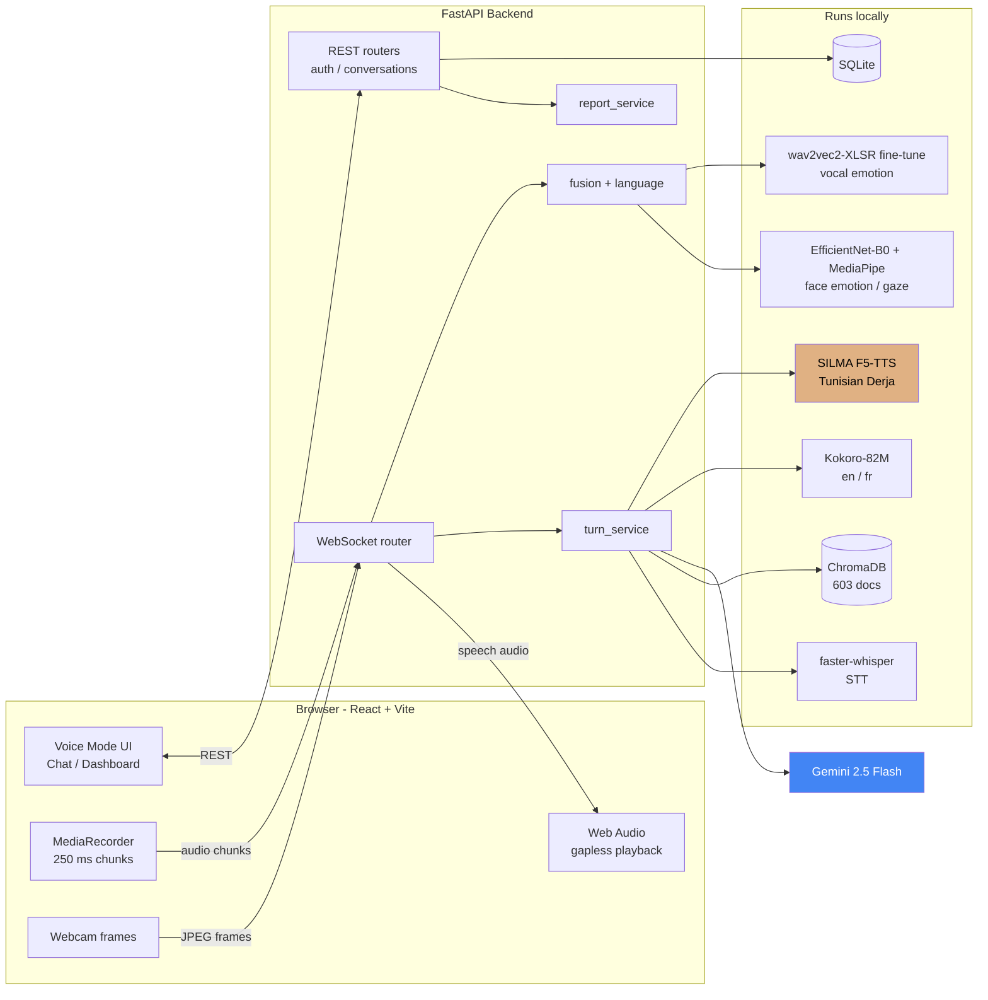
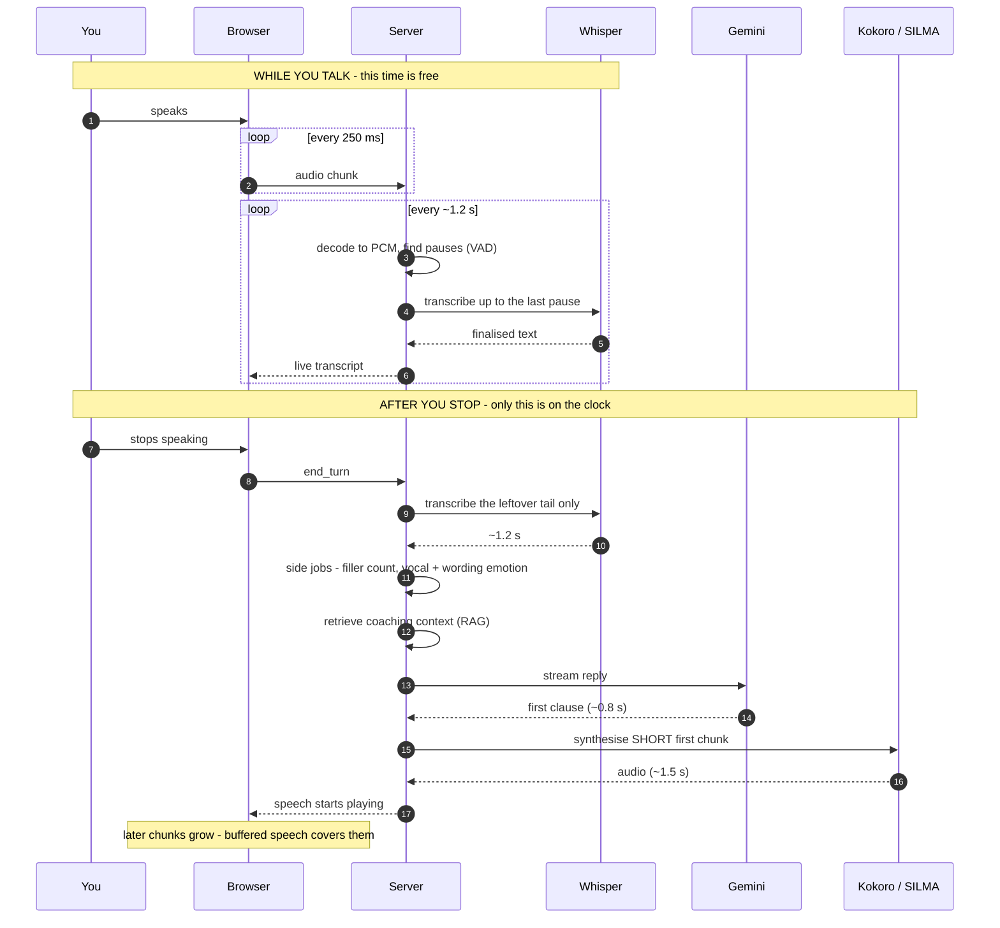
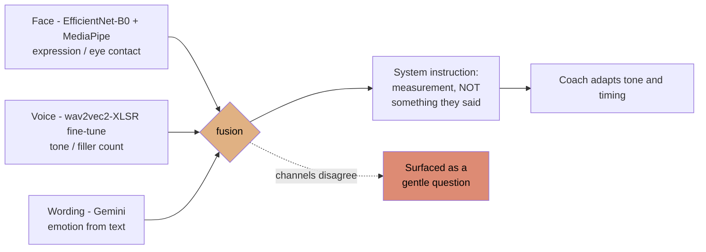
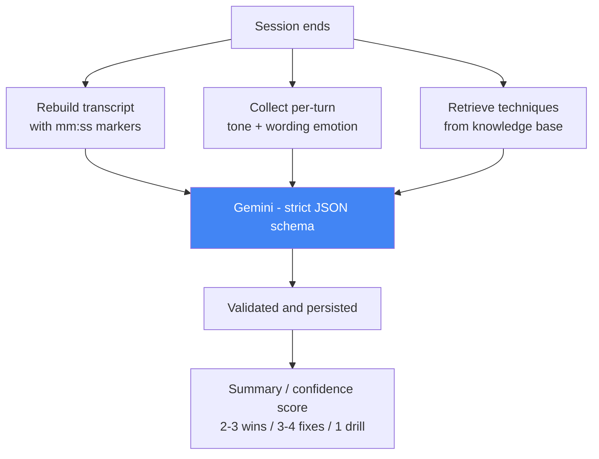

<div align="center">

# Solace

**A real-time, multimodal AI psychological coach — one that reads your face, hears your tone, and answers with a named therapeutic technique instead of a platitude.**

### 👁️ It watches your face to read your emotions. 🔊 It listens to your voice to read them again. ⚡ Both in real time, while you are still speaking.

Solace runs **two independent emotion classifiers on you at once** — a facial-expression model on your webcam frames and a **fine-tuned wav2vec2-XLSR-53 speech-emotion model** on your voice. Face gives expression, gaze, and self-touch gestures at interactive frame rates. Voice gives emotional tone from *how* you sound, not what you said, at high accuracy on unseen speakers — because it was evaluated speaker-independently, not on the leaky random split that inflates every other number you have seen.

Then it answers out loud — in English, French, or Tunisian Derja — grounded in **603 documents of real clinical psychology**: CBT protocols, Motivational Interviewing manuals, Gottman, NVC, DBT, attachment theory.

[](https://www.python.org/)
[](https://fastapi.tiangolo.com/)
[](https://developer.mozilla.org/docs/Web/API/WebSockets_API)
[](https://docs.pydantic.dev/)
[](https://www.sqlalchemy.org/)
[](https://www.sqlite.org/)

[](https://react.dev/)
[](https://vite.dev/)
[](https://tailwindcss.com/)
[](https://zustand-demo.pmnd.rs/)
[](https://reactrouter.com/)
[](https://recharts.org/)
[](https://developer.mozilla.org/docs/Web/API/Web_Audio_API)

[](https://pytorch.org/)
[](https://huggingface.co/docs/transformers)
[](https://huggingface.co/Ghazouaniwala/silma-tts-derja)
[](https://huggingface.co/Ghazouaniwala/emotions_speech)
[](https://onnxruntime.ai/)

[](https://ai.google.dev/)
[](https://www.trychroma.com/)
[](https://www.sbert.net/)
[](https://github.com/SYSTRAN/faster-whisper)
[](https://github.com/snakers4/silero-vad)
[-Vosk_linto--ar--tn-1E88E5)](https://alphacephei.com/vosk/)
[](https://github.com/SWivid/F5-TTS)
[](https://huggingface.co/hexgrad/Kokoro-82M)
[](https://developers.google.com/mediapipe)
[](https://opencv.org/)
[](https://librosa.org/)
[](https://spacy.io/)

[](https://www.docker.com/)
[](https://jwt.io/)
[](https://developers.google.com/identity)
[](https://zenodo.org/records/1188976)

</div>

---

## Table of contents

- [The problem](#the-problem)
- [What Solace does](#what-solace-does)
- [Real-time emotion sensing](#real-time-emotion-sensing)
- [A psychological coach, not an interview bot](#a-psychological-coach-not-an-interview-bot)
- [The fine-tuned models](#the-fine-tuned-models)
- [Screenshots](#screenshots)
- [Architecture](#architecture)
- [Pipelines](#pipelines)
- [Performance](#performance)
- [Tech stack](#tech-stack)
- [Getting started](#getting-started)
- [How to use it](#how-to-use-it)
- [Configuration](#configuration)
- [Project structure](#project-structure)
- [Known limitations](#known-limitations)
- [Roadmap](#roadmap--how-this-could-be-improved)

---

## The problem

> Sarra has a final-round interview on Thursday. She has rehearsed her answers a dozen times in her head, and they sound fine in there. What she cannot rehearse is the part that actually costs her the offer: the way her voice tightens when she is asked about salary, the four *"euh…"*s she packs into one sentence, the way she looks at the table instead of the camera when she talks about leaving her last job.
>
> A human coach would catch all of that in ten minutes. A human coach also costs 80 DT an hour and books out two weeks ahead.
>
> So Sarra opens Solace, picks **Professional**, and starts talking — in the mix of Derja and French she actually speaks. The coach answers out loud, in the same language, about a second after she stops. It notices she goes quiet on the salary question and asks her why. Afterwards it hands her a debrief: three things that landed, three to fix, each one timestamped to the moment it happened, each fix tied to a named technique from a real coaching manual.

Interview practice is only the most legible use of Solace. The harder one:

> Mehdi is not preparing for anything. He has been having the same fight with his partner for four months and cannot describe it without his jaw tightening. Talking to a therapist means a waiting list, a fee, and saying the words out loud to a stranger.
>
> He opens Solace in **Psychology** mode and just talks. The coach reflects back what it heard before offering anything — because that is what Motivational Interviewing says to do, and the retrieved passage telling it so came out of the SAMHSA TIP-35 manual. When his wording stays calm but his voice reads `angry`, it does not tell him he is angry. It asks about the gap. When he describes the fight as *"she always does this"*, the response is built on Gottman's **Soft Startup** and NVC's **observation vs. evaluation** — named techniques, retrieved from real clinical material, not improvised sympathy.

**Most "AI coach" tools are a chatbot with a text box.** They read your words and miss the entire signal — the hesitation, the flat delivery, the broken eye contact. They also generate advice from nothing but the base model's vibes. And essentially none of them work in Tunisian Derja, which is what a Tunisian actually panics in.

Solace is built for the gap between those facts: **measure the channels a text box cannot see, then answer from a body of real psychology instead of from nowhere.**

---

## What Solace does

| | |
|---|---|
| 🎙️ **Speaks and listens in real time** | Full-duplex voice over WebSocket. Interrupt it mid-sentence and it stops, like a person would. |
| 🇹🇳 **Handles Tunisian Derja** | Speech synthesis runs on a **custom F5-TTS fine-tune** (`Ghazouaniwala/silma-tts-derja`), with Derja-aware prompting that mirrors natural Derja/French code-switching. |
| 👁️ **Reads emotion off your face** | An EfficientNet-B0 expression classifier (ONNX, 8 classes) runs on webcam frames, with MediaPipe landmarks for gaze direction and self-touch gestures. Live, every 3rd frame, smoothed over a 5-frame window. |
| 🔊 **Reads emotion off your voice** | A **fine-tuned wav2vec2-XLSR-53** classifier reads vocal tone across 7 emotions — from acoustics alone, independent of the words. A second verbatim pass counts filler words. |
| 🧠 **Separates its evidence** | Face, voice, and wording are three independent channels. When they disagree, that gap is surfaced — not averaged away. |
| 📚 **Answers with named techniques** | Every piece of advice is retrieved from a 603-document knowledge base of real clinical material — CBT protocols, Motivational Interviewing manuals, Gottman, NVC, DBT, attachment theory — and cited by technique name. |
| 🌍 **Follows your language, per turn** | Start in English, switch to French mid-session — the very next reply comes back in French, voice included. |
| 📊 **Writes you a real debrief** | A timestamped, technique-cited report with a confidence score and a practice drill. |

Three coaching modes — **Psychology**, **Professional**, and **Sport** — swap the persona and steer which part of the knowledge base is searched.

---

## Real-time emotion sensing

This is the part a text box cannot do. Two classifiers run on you continuously, on different physical signals, and neither one reads your words.

### 👁️ Face → emotion

| | |
|---|---|
| **Model** | `enet_b0_8_best_afew` — EfficientNet-B0, 8 expression classes, via [EmotiEffLib](https://github.com/av-savchenko/face-emotion-recognition) |
| **Runtime** | ONNX Runtime, CPU, interactive frame rates |
| **Also measured** | Eye contact (gaze ratio from MediaPipe Face Landmarker, thresholded), self-touch gestures (Hand Landmarker proximity to face) |
| **Stability** | Inference every 3rd frame, label smoothed over a rolling 5-frame buffer — so a single blink or head turn cannot flip the reading |

### 🔊 Voice → emotion

| | |
|---|---|
| **Model** | **`Ghazouaniwala/emotions_speech`** — our own wav2vec2-large-XLSR-53 fine-tune |
| **Classes** | `neutral · happy · sad · angry · fearful · disgust · surprised` |
| **Input** | Raw 16 kHz waveform, 4-second clips, up to 6 chunks per turn — **acoustics only**, no transcript |
| **Accuracy** | High, and *honestly* high — see [the fine-tuned models](#the-fine-tuned-models) for why the evaluation protocol is the interesting part |

**Both run on your machine.** Frames and audio are analysed locally; only text ever reaches the cloud.

### Why two channels and not one average

Because the disagreement *is* the signal. A user whose wording reads `neutral` while their voice reads `fearful` is the single most useful thing the system can notice — and averaging the two channels into one number destroys exactly that. So the fusion layer keeps them separate, hands the model all three readings labelled by source, and instructs it that these are **classifier outputs, not facts**: it must say *"your wording read as frustrated"*, never *"you sounded frustrated"*, and it may never claim to have observed a channel that did not report.

---

## A psychological coach, not an interview bot

Solace is a **psychology-first coach**. Interview prep is one mode of three; the core of the system is a retrieval layer over real clinical and counselling material, and a coach that responds *through named techniques* rather than generic encouragement.

### What is actually in the knowledge base

**603 documents**, assembled by four collection pipelines (therapist manuals, PubMed open-access abstracts, academic papers, curated articles), chunked and embedded with `multilingual-e5-base`:

| Tier | Count | What it is |
|---|---:|---|
| `session_guide` | 346 | Full therapist manuals — chunked CBT protocols, MI guided dialogues |
| `abstract` | 158 | PubMed research abstracts |
| `technique` | 60 | Structured technique records (20 psy · 20 professional · 20 sport) |
| `article` | 39 | Curated psychology and coaching articles |

By domain: **364 psychology** · 155 sport · 70 professional · 14 cross-mode.

Core sources include **SAMHSA TIP-35** (*Enhancing Motivation for Change*, 159 chunks), the **VA Brief CBT Therapist Manual**, the **VA CBT for Chronic Pain** manual, MI guided-dialogue transcripts, reflective-listening refreshers, person-centered therapy references, and alliance-rupture-repair clinical consensus.

### The technique layer

The 60 technique records are not prose — they are structured JSON, and the structure is what makes them usable mid-conversation. Each one carries its `source_framework` and academic citation, the `applicable_scenarios` it fits, the **`detected_signals` that should trigger it**, the problem it solves, when to use it, a practice drill, and its common failure modes.

That `detected_signals` field is the bridge from measurement to intervention: signals like `low_back_channel_rate`, `frequent_interruption_detected`, `advice_giving_before_listening`, or `response_latency_too_short` map an observed behaviour to the technique that addresses it.

**Frameworks represented in the psychology set:**

| Framework | Techniques |
|---|---|
| **Motivational Interviewing** / Person-Centered | Reflective Listening (simple + complex), Empathic Validation, Open Questions, OARS |
| **Gottman Method** | Four Horsemen, Soft Startup, Repair Attempts, Dreams Within Conflict |
| **Nonviolent Communication** | Four Steps, Observation vs. Evaluation, Feeling Words, Unmet Needs, Requests vs. Demands |
| **Emotion regulation / CBT** | Cognitive Reappraisal, Affect Labeling, STOP, Window of Tolerance |
| **DBT** | DEAR MAN |
| **Attachment theory** | Attachment styles in conflict, Protest Behavior, Emotional Safety |

### How it constrains the model

Retrieval is not decoration. In the session report, **every improvement must name a technique from the retrieved list by its exact name — or return `null`.** Every observation must cite a real `[mm:ss]` moment from the transcript. The prompt explicitly forbids inventing events, numbers, quotes, or techniques. A coach that cannot ground a suggestion is required to say nothing rather than improvise.

Retrieval fails **open**: if ChromaDB is unavailable the session continues un-grounded rather than breaking.

---

## The fine-tuned models

Two models here were trained for this project and published, because nothing off the shelf did the job.

### 1. `Ghazouaniwala/emotions_speech` — speech emotion recognition

A **wav2vec2-large-XLSR-53** fine-tune that classifies emotional tone from raw audio.

**Architecture beyond a plain classification head:**
- A **learned weighted sum over all 25 transformer hidden states** (`nn.Parameter(torch.ones(25))`) instead of using only the final layer — emotion lives in the mid-layers, and letting the model choose the mixture beats guessing.
- A projected residual path: `LayerNorm → 768→384 → GELU → 384→128` alongside a linear `proj_skip` shortcut, summed before the classifier.
- 4-second clips at 16 kHz, up to 6 chunks aggregated per turn.

**Trained on RAVDESS with speaker-independent `GroupKFold`** — and the split is asserted at runtime, not merely intended:

```python
assert len(train_actors & test_actors) == 0, "Speaker leakage!"
```

> **This assert is the most important line in the training pipeline.** A random split puts the same actors in train and test, so the model learns to recognise *voices* rather than *emotions* — producing ~90%+ headline accuracy that collapses on the first unseen speaker. Speaker-independent evaluation gives a number that actually survives contact with a real user.

Training used focal loss (class imbalance), mixup, label smoothing, cosine annealing with warm restarts, and heavy augmentation with ESC-50 environmental noise. A complementary **EfficientNet-B2 on multi-channel spectrograms** (mel + MFCC + delta-MFCC) was trained as a second view for ensembling.

*Measured accuracy / macro-F1 from the speaker-independent folds: see `backend/training/evaluate_models.ipynb`.*

### 2. `Ghazouaniwala/silma-tts-derja` — Tunisian Derja speech synthesis

An **F5-TTS** fine-tune, and the reason Solace can speak Derja at all.

**The problem it solves:** every off-the-shelf Arabic TTS produces **Modern Standard Arabic** — a formal register nobody speaks conversationally. A coach that answers a nervous Tunisian in MSA sounds like a news broadcast, which is roughly the opposite of the intended effect. There was no usable Derja voice, so one was fine-tuned.

It runs **locally, in-process** (`SILMA_PROVIDER=local`), and pairs with Derja-aware prompting that mirrors natural Derja/French code-switching rather than suppressing it.

*Honest limitation:* F5-TTS is a voice-cloning architecture and the shipped reference clip is an English sample — Derja prosody would improve measurably with a native Derja reference recording. Noted in [Known limitations](#known-limitations).

---

## Screenshots

### Voice Mode


*Push-to-talk with live state (`LISTENING` → `THINKING` → `SPEAKING`). The orb is driven by a live FFT of the audio stream, so it reacts to your actual voice. Keyboard-first: `Space` to talk, `M` mute, `V` video, `Esc` back.*

### The session report


*Generated from a real 8-minute session. Note the **provenance labels**: `Measured` for filler rate (1 filler across 6 spoken turns) versus `Model estimate` for the confidence score — and eye contact marked **`NOT MEASURED`** because the camera was off. The system reports what it could not observe rather than inventing a number.*

### Home — mode selection and history


*Three coaching modes, quick-start prompts, and entry into voice or video. The sidebar shows real sessions in both English and French — the per-turn language routing in daily use.*

### Your patterns — cross-session analytics

| Trends over time | Voice vs. words |
|---|---|
|  |  |

*Left: filler-word rate, emotion mix, and per-session trends across 16 analysed sessions. Right: the **channel-disagreement** view — where your wording read `Fearful` but your voice read `Neutral`. This is the multimodal fusion made visible, and it deliberately says "too few turns to read anything into yet" rather than over-claiming on thin data.*

### Sign in


*Email + password with 6-digit verification, or Google OAuth.*

---

## Architecture

The browser holds **one WebSocket** open for the whole session — audio and video frames go up, text and speech come back down. Everything else (auth, history, reports) is ordinary HTTP.



**Design note:** Gemini is the *only* cloud dependency. Speech recognition, both speech synthesis engines, the vector store, and both signal analysers all run on the host machine. That is a deliberate privacy choice — practice sessions about your job, your anxiety, or your relationships never leave your machine except as text to the LLM.

---

## Pipelines

### 1. The voice turn — the loop that matters

The core insight: **most of the work happens while you are still speaking**, so when you stop, there is very little left to do.



**Two optimisations do the heavy lifting:**

1. **Incremental transcription.** Audio is decoded to raw PCM and cut **only inside silences** detected by VAD — never mid-word. Each region of speech is transcribed exactly once, while you are still talking. Post-speech transcription dropped from **5.10 s → 1.24 s**.

2. **Smallest-chunk-first synthesis.** Kokoro does not stream — its first byte arrives with its last — and costs roughly `0.8 s + 0.03 s × characters`. So time-to-first-audio is set almost entirely by how much text the *first* request carries. The opening chunk is cut at the first clause boundary; later chunks grow. First chunk went from **132 → 52 characters**.

### 2. Multimodal signal fusion



`fusion.fuse()` assembles the three readings into a single labelled summary line, then `summary_line()` renders it for the system instruction under the phrasing rules described in [Why two channels and not one average](#why-two-channels-and-not-one-average). Typed conversations carry only the wording channel, and the model is told so explicitly — so it cannot allude to a tone or an expression it was never given.

### 3. The session report



Every observation must cite a real `[mm:ss]` moment, and every improvement must name a technique from the retrieved list *by its exact name* — or return `null`. The prompt forbids inventing events, numbers, or quotes.

---

## Performance

Measured end to end on a real 39-second spoken turn (CPU-only, `whisper-base`, Kokoro CPU container):

| Stage | Before | After | Gain |
|---|---:|---:|---|
| Speech-to-text after you stop | 5.10 s | **1.24 s** | **4.1× faster** |
| Knowledge retrieval (warm) | 0.05 s | 0.05 s | — |
| Gemini to first token | 0.79 s | 0.79 s | — |
| First speech audio | 5.49 s | **~2.4 s** | **2.3× faster** |
| **Total silence before the coach replies** | **~11.4 s** | **~4.5 s** | **2.5× faster** |

**The trade-off, stated honestly:** incremental transcription costs ~0.4× real-time of background CPU while you speak, and chunked decoding produces text that differs somewhat from a single pass over the whole recording. Speed was bought with CPU and a little transcription stability — not for free.

### Signal analysis cost

The emotion channels are deliberately kept **off the critical path**. Vocal emotion, filler counting, and wording emotion are dispatched as `asyncio.to_thread` tasks at `end_turn` and run concurrently with retrieval and generation — they add nothing to time-to-first-audio. Face analysis runs continuously on the inbound frame stream at every 3rd frame and never blocks a turn.

**The consequence, stated plainly:** because those tasks are still running when the reply starts streaming, the voice and wording readings handed to the coach are the **previous** turn's — one turn of lag. The face channel is current. Every reading still lands in the session report against the turn it was measured on; the lag affects only how fast the spoken coaching can react to a tonal shift. Removing it would mean blocking the reply on classification, which costs more than it buys.

Training and evaluation details for the vocal model — including the speaker-independent protocol — are in [The fine-tuned models](#the-fine-tuned-models).

---

## Tech stack

| Layer | Technology | Why |
|---|---|---|
| **Frontend** | React 19 + Vite 8, Tailwind CSS, Zustand, React Router 7, Recharts | Zustand over Redux for far less ceremony; Recharts for the cross-session analytics views |
| **Audio (browser)** | Web Audio API, MediaRecorder, `@ricky0123/vad-web` | Sample-accurate gapless playback; client-side VAD for responsive push-to-talk |
| **Backend** | FastAPI, WebSockets, Pydantic Settings | Native async + first-class WebSocket support; typed config and response schemas |
| **STT** | faster-whisper + Silero VAD | Much faster than reference Whisper; VAD enables silence-safe incremental cuts |
| **LLM** | Google Gemini 2.5 Flash (`google-genai`) | Sub-second time-to-first-token; streaming; strict JSON mode for reports |
| **TTS (en/fr)** | Kokoro-82M via Kokoro-FastAPI (Docker) | 82M params, runs on CPU, natural prosody |
| **TTS (Derja)** | **`Ghazouaniwala/silma-tts-derja`** — our F5-TTS fine-tune | Off-the-shelf Arabic TTS produces MSA, not Derja — this was fine-tuned to fix that |
| **STT (Derja)** | Vosk `linto-asr-ar-tn` | Purpose-built Tunisian Arabic acoustic model |
| **RAG** | ChromaDB + `multilingual-e5-base` (sentence-transformers) | Multilingual embeddings matter when queries arrive in three languages |
| **Face emotion** | EmotiEffLib `enet_b0_8_best_afew` (EfficientNet-B0, ONNX Runtime) | 8-class expression at interactive CPU frame rates |
| **Face geometry** | MediaPipe Face + Hand Landmarker, OpenCV | Gaze ratio and self-touch detection; OpenCV decodes JPEG frames |
| **Vocal emotion** | **`Ghazouaniwala/emotions_speech`** — our wav2vec2-XLSR-53 fine-tune | Self-supervised pretraining survives a small emotion dataset; layer-weighted pooling over all 25 hidden states |
| **Text emotion** | Gemini as a zero-shot classifier | Evidence spans are verified verbatim against the source message, or dropped |
| **ML runtime** | PyTorch, Transformers, ONNX Runtime, librosa, NumPy | Torch for the fine-tunes, ONNX for the vision path, librosa for audio DSP |
| **NLP** | spaCy, `langdetect` | Text processing; reply-language detection for typed chat |
| **Training** | RAVDESS, ESC-50 augmentation, scikit-learn `GroupKFold` | Speaker-independent evaluation is the whole point — see [the fine-tuned models](#the-fine-tuned-models) |
| **Database** | SQLite + SQLAlchemy | Zero-config for a single-node deployment |
| **Auth** | JWT + httpOnly refresh cookie, bcrypt, Google OAuth | Email verification via SMTP |

---

## Getting started

### Prerequisites

- **Python 3.12+**
- **Node.js 20+**
- **Docker** (for the Kokoro TTS container)
- A **Google Gemini API key** — [get one free](https://aistudio.google.com/apikey)
- A **Gmail App Password** for verification emails — [create one](https://myaccount.google.com/apppasswords) (requires 2-Step Verification)

### 1. Clone and configure

```bash
git clone https://github.com/<your-username>/solace.git && cd solace
```

```bash
cp backend/.env.example backend/.env
```

Open `backend/.env` and fill in `GEMINI_API_KEY`, `GMAIL_USER`, `GMAIL_APP_PASSWORD`, and the Google OAuth keys. Every field is documented inline.

### 2. Backend

```bash
cd backend && python -m venv venv && venv/Scripts/activate && pip install -r requirements.txt
```

> On macOS/Linux use `source venv/bin/activate`.

### 3. The fine-tuned emotion model

Downloads the vocal-emotion checkpoint (~1.3 GB, resumable) from Hugging Face:

```bash
python backend/scripts/setup_emotion_model.py
```

> Verify it with `python backend/scripts/verify_emotion_model.py`. Without this checkpoint the voice-emotion channel stays dark — face and wording still work.

### 4. Speech synthesis

```bash
docker run -d -p 8880:8880 --name solace-kokoro ghcr.io/remsky/kokoro-fastapi-cpu:latest
```

> Set `KOKORO_AUTOSTART=true` in `.env` to have the backend manage this container itself.

Optional — the Tunisian Derja voice:

```bash
python backend/scripts/setup_silma_tts.py
```

### 5. Frontend

```bash
cd frontend && npm install && npm run dev
```

### 6. Run

```bash
cd backend && venv/Scripts/python.exe -m uvicorn main:app --reload --port 8000
```

Open **http://localhost:5173**. API docs live at **http://localhost:8000/docs**.

> **First launch is slow.** Whisper, the embedding model, MediaPipe bundles, and the emotion checkpoint all load at startup — expect 30–60 s before the first turn. They are warmed in a background thread so the UI stays responsive.

---

## How to use it

### Your first session

1. **Sign up** with an email address. A 6-digit code arrives in your inbox (valid 10 minutes). Google sign-in also works.
2. **Pick a mode** — Psychology, Professional, or Sport. This sets the coach's persona *and* which knowledge base sections get searched.
3. **Choose voice or text.** Voice Mode is the full experience.

### In Voice Mode

| Control | What it does |
|---|---|
| 🎤 **Hold to talk** | Records and streams while you speak — your transcript appears live |
| 📷 **Camera toggle** | Enables face analysis: expression, eye contact, self-touch |
| ✋ **Interrupt** | Start talking while the coach speaks and it stops immediately |
| 🌍 **Just switch language** | Say a sentence in French — the next reply comes back in French, voice included |

### Getting a useful report

- **Talk for at least 3–4 turns.** The report needs material; two turns produce thin results.
- **Keep the camera on** for the full picture — without it there is no expression or eye-contact data, and the report will say so rather than guess.
- **Click "End session"** — the report takes 10–20 s to generate.
- **Read the timestamps.** Every observation cites `[mm:ss]`, so you can replay the exact moment.

### Tips

- Practice a **real** upcoming conversation, not a hypothetical — the signal analysis is only interesting when you are genuinely a bit nervous.
- Use headphones to stop the coach's voice bleeding into your microphone.
- Speak Derja naturally, mixing in French — the prompt explicitly expects code-switching.

---

## Configuration

All settings live in `backend/.env` (see `.env.example`). The ones worth knowing:

| Variable | Default | What it controls |
|---|---|---|
| `GEMINI_MODEL` | `gemini-2.5-flash` | Coaching LLM |
| `WHISPER_MODEL` | `base` | `small`/`medium` are far more accurate but slower |
| `LANG_SWITCH_SUSTAIN_TURNS` | `1` | `1` = switch language on the very next turn; raise for stickier behaviour |
| `LANG_SWITCH_CONFIDENCE` | `0.6` | Detection confidence required before switching |
| `SILMA_PROVIDER` | `local` | `local` runs the Derja fine-tune in-process |
| `VIDEO_ANALYSIS_ENABLED` | `true` | Master switch for webcam analysis |
| `EMAIL_FAIL_SILENTLY` | `false` | Keep `false` so failed sends surface as errors |

---

## Project structure

```
solace/
├── backend/
│   ├── routers/          # ws.py (voice loop) · auth · conversations · messages · analytics
│   ├── services/
│   │   ├── stt_router.py       # STT engine selection (Whisper / Derja)
│   │   ├── tts_router.py       # TTS engine selection (Kokoro / SILMA)
│   │   ├── llm_service.py      # Gemini prompts: coaching, report, emotion
│   │   ├── rag_engine.py       # ChromaDB retrieval
│   │   ├── fusion.py           # combines face + voice + wording signals
│   │   ├── language_service.py # per-turn language resolution
│   │   ├── face_analyzer.py    # MediaPipe expression / eye contact
│   │   ├── emotion_model.py    # wav2vec2-XLSR vocal emotion
│   │   └── report_service.py   # session debrief generation
│   ├── data/rag_collection/    # knowledge-base ingestion pipeline
│   ├── training/               # RAVDESS emotion model training + evaluation
│   └── tests/
└── frontend/src/
    ├── components/voice/       # VoiceMode · VoiceOrb
    ├── services/audioEngine.js # gapless Web Audio playback
    ├── hooks/                  # useVAD · useWebcam · useAudioRecorder
    └── pages/
```

---

## Known limitations

Stated plainly, because a reviewer will find them anyway:

- **Derja speech recognition currently routes to multilingual Whisper.** The Vosk Tunisian model ships and the routing layer supports it, but `DERJA_STT_BACKEND` is unset by default, so Derja is transcribed at roughly MSA quality. Derja *synthesis* uses the fine-tuned model and is unaffected.
- **The SILMA reference voice is an English sample.** F5-TTS is a voice-cloning architecture, so Derja prosody would improve measurably with a native Derja reference clip.
- **Incremental transcription trades some stability for latency.** Chunked decoding differs from a single pass, most noticeably on long unbroken speech.
- **Voice and wording emotion reach the coach one turn late.** They are classified in background threads to keep them off the latency path, so the reply to turn N carries turn N−1's readings. The face channel is live, and the report is unaffected. See [Signal analysis cost](#signal-analysis-cost).
- **The expression classifier is trained on AFEW**, a Western-actor film corpus — the same cultural-distribution caveat that applies to RAVDESS for the voice model applies here.
- **SQLite and in-memory session state** mean a single backend instance. Horizontal scaling needs Postgres and Redis.
- **CPU-bound.** Whisper and Kokoro dominate the latency budget; a GPU roughly halves the numbers above.

---

## Roadmap — how this could be improved

**Latency**
- GPU inference for Whisper and Kokoro — the single biggest remaining win
- Replace Kokoro with a genuinely streaming TTS to remove the fixed per-chunk cost
- Start RAG retrieval from the *partial* transcript while the user is still speaking

**Quality**
- Wire the Vosk Derja STT backend and benchmark it against Whisper on real Derja audio
- Record a native Derja reference clip for the voice-cloning model
- Fine-tune the emotion classifier on Tunisian speech — RAVDESS is North American English
- Re-score the retriever with a cross-encoder before results reach the prompt

**Product**
- Progress tracking across sessions (filler-word trend, confidence over time)
- Scenario library: salary negotiation, difficult feedback, first-date nerves
- Export reports to PDF
- Mobile-responsive Voice Mode

**Engineering**
- Postgres + Redis for multi-instance deployment
- Broader test coverage — the WebSocket turn loop is currently under-tested
- CI pipeline running the test suite and a linter on every push
- Structured telemetry to track real-world latency instead of one benchmark machine

---

## Acknowledgements

Built with [faster-whisper](https://github.com/SYSTRAN/faster-whisper), [Silero VAD](https://github.com/snakers4/silero-vad), [Kokoro-82M](https://huggingface.co/hexgrad/Kokoro-82M), [F5-TTS](https://github.com/SWivid/F5-TTS), [Vosk](https://alphacephei.com/vosk/), [MediaPipe](https://developers.google.com/mediapipe), [EmotiEffLib](https://github.com/av-savchenko/face-emotion-recognition), [ChromaDB](https://www.trychroma.com/), [sentence-transformers](https://www.sbert.net/), and [Google Gemini](https://ai.google.dev/).

**Models fine-tuned for this project:**

| Model | Base | Purpose |
|---|---|---|
| [`Ghazouaniwala/emotions_speech`](https://huggingface.co/Ghazouaniwala/emotions_speech) | wav2vec2-large-XLSR-53 | 7-class speech emotion recognition |
| [`Ghazouaniwala/silma-tts-derja`](https://huggingface.co/Ghazouaniwala/silma-tts-derja) | F5-TTS | Tunisian Derja speech synthesis |

Emotion model trained on [RAVDESS](https://zenodo.org/records/1188976), augmented with [ESC-50](https://github.com/karolpiczak/ESC-50) environmental noise.

Knowledge base assembled from openly licensed clinical and coaching material (SAMHSA TIP-35, VA CBT manuals, motivational-interviewing guides, sport-psychology literature).

---

<div align="center">

**Solace** — *comfort, and psychological ease.*

</div>
