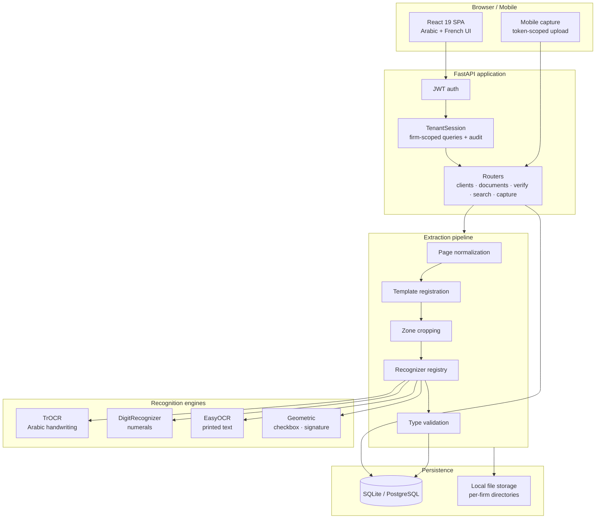
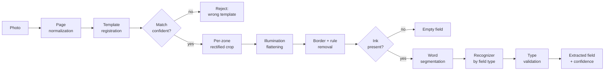
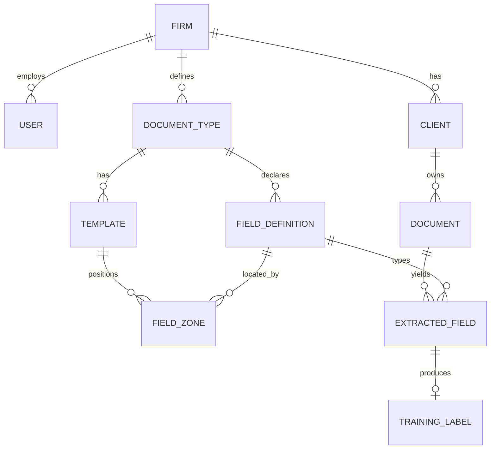

# Wathika

**Document intake automation for Tunisian law firms.** Photograph a handwritten
client form with a phone, and it becomes a structured, searchable client record —
without the paper ever leaving the office.

> Arabic-first · offline by design · multi-tenant · human-in-the-loop

<p align="center">
  
</p>


---

## Table of contents

- [The problem](#the-problem)
- [What Wathika does](#what-wathika-does)
- [Use cases](#use-cases)
- [System architecture](#system-architecture)
- [The extraction pipeline](#the-extraction-pipeline)
- [Recognition layer](#recognition-layer)
- [Template designer](#template-designer)
- [Multi-tenancy and data isolation](#multi-tenancy-and-data-isolation)
- [Feature tour](#feature-tour)
- [Interface](#interface)
- [Tech stack](#tech-stack)
- [Data model](#data-model)
- [API surface](#api-surface)
- [Running it locally](#running-it-locally)
- [Testing](#testing)
- [Engineering decisions worth calling out](#engineering-decisions-worth-calling-out)
- [Roadmap](#roadmap)

---

## The problem

A Tunisian law firm's intake process is paper. A client arrives, fills in a
*كتب تكليف* (engagement letter) or a *وصل خلاص* (payment receipt) by hand, and
that sheet goes into a folder. The information on it — name, national ID,
matter type, fees — exists only on that page.

The consequences compound quietly:

- **Nothing is searchable.** Finding every matter for one client means opening
  drawers.
- **The same data is typed repeatedly.** A client's CIN is rekeyed into every
  new document, every time, with a fresh chance of transposing a digit.
- **Conflict checks are manual.** Before accepting a matter, a firm must know
  whether it already acts against that party. On paper, this relies on memory.
- **Nothing can be handed to cloud OCR.** These documents contain client
  identity data protected by professional privilege and by Tunisia's INPDP
  regime. Uploading them to a third-party API is not an option a firm can
  responsibly take.

The last constraint is the one that shapes the whole system. Wathika is built
to run entirely on the firm's own machine.

---

## What Wathika does

1. **Capture** — a form is photographed with a phone, or uploaded from a
   scanner. No special hardware, no controlled lighting, no flatbed required.
2. **Locate** — the page is matched against a stored template, and every field
   on the form is located in the photograph.
3. **Read** — each field is cropped and routed to a recognizer chosen for that
   field's type: handwritten Arabic, numerals, checkbox, or signature.
4. **Verify** — a human reviews the extracted values side by side with the
   original crops, correcting anything that needs it.
5. **Commit** — verified values populate the client record, and every
   correction is retained as a labelled training example.

The last point is the design's centre of gravity: **routine use of the system
produces the data that improves it.** Every verification is a label.


---

## Use cases

| Scenario | How Wathika handles it |
|---|---|
| **New client onboarding** | The engagement letter is photographed at the desk. Name, surname, CIN and issue date populate a new client record automatically. |
| **Bulk backfile scanning** | An assistant works through a filing cabinet. Documents queue, process in the background, and surface for review in batches. |
| **Conflict checking** | Full-text and field search across every document ever processed, by client name, CIN, or matter description. |
| **Fee reconciliation** | Payment receipts are typed as their own document class with amount and date fields, so receipts reconcile against engagement letters. |
| **Mobile field capture** | A lawyer signs a client at court. A time-limited capture link opens on their phone; the document lands in the office queue immediately. |
| **New form types** | The firm adds its own forms through the template designer — no code change, no developer involvement. |

---

## System architecture



Everything inside the diagram runs on one machine. There is no outbound network
call in the document path — the models are local, the storage is local, the
database is local.

---

## The extraction pipeline

The pipeline turns a photograph taken at an angle, on a desk, under uneven
light, into a set of tight field crops with known semantics.



### 1. Page normalization

Detects the page quad in the photograph and perspective-warps it flat into a
canonical frame. Three tiers run in order so that *something* usable comes out
of almost any input:

| Tier | Trigger | Behaviour |
|---|---|---|
| `page_quad` | Page edges found | Perspective-warp the quad flat — the accurate path |
| `content_bbox` | No page edge (borderless scan) | Crop to the ink bounding box, fit to canonical |
| `letterbox` | Nothing detectable | Scale to fit and centre on white — never crops, never stretches |

Fallback tiers set a flag so downstream consumers know the framing is
approximate. Residual skew is corrected by a deskew pass; contrast is equalised
with CLAHE.

### 2. Template registration

This is the step that makes field location robust.

Field zones are stored as fractions of a template's canonical frame. Slicing
those fractions out of a normalized image only works if normalization reproduced
the template's framing exactly — and on a handheld capture it often cannot.

Instead, Wathika matches the **raw photograph** directly against the
template's reference image using SIFT features and a RANSAC-estimated
homography. Zone rectangles are then projected through that homography onto the
photo.

```
template sample ──SIFT──┐
                        ├── FLANN match ── MAGSAC++ ── refine on inliers ── H
captured photo  ──SIFT──┘
```

This has three properties worth having:

- **It absorbs geometry.** Perspective, rotation, scale and translation are all
  handled in one transform, so field location no longer depends on the page
  detector having produced a perfect crop.
- **Crops come out rectified.** Rather than taking the bounding box of a rotated
  quad, each zone is warped *back* into template space, so the page's tilt is
  undone per field.
- **The match score is a document classifier.** The RANSAC inlier ratio measures
  how well the capture agrees with the template. A capture of a *different* form
  from the same office — same letterhead, same footer — scores far below a
  correct pairing, so a receipt processed against an engagement-letter template
  is rejected rather than silently mis-extracted.

Template features are cached per template, and detection runs at a capped
working resolution, so registration adds a fraction of a second per document.

### 3. Crop conditioning

Zone crops arrive with the printed box border and a margin of empty paper.
Recognizers want tight word crops. Three passes get there:

- **Illumination flattening.** A handheld photo puts a lighting gradient across
  the page. Global thresholding on such a crop separates *shadow from light*
  rather than *ink from paper*. Dividing out a morphological background estimate
  removes the gradient while leaving strokes intact — the strokes are too thin to
  survive the background close.
- **Rule removal.** Directional morphological opens isolate the long horizontal
  and vertical runs that make up printed box borders and ruling lines, which are
  then subtracted from the ink mask. This catches interior baseline rules that no
  fixed margin trim can reach.
- **Empty-field detection.** Ink remaining *after* the rules are subtracted is
  the blank test. Before subtraction, an empty box and a filled one look alike —
  the border dominates a small crop. Fields with no ink are reported empty and
  never reach a model, because a text model given a blank image answers with
  confident nonsense rather than silence.

### 4. Word segmentation

The handwriting model is trained on isolated words. Arabic joins letters within
a word but not between words, so inter-word gaps are the reliable separator.
Dilating the ink mask horizontally by a kernel scaled to **text height** — not
crop width, which varies threefold across fields — merges each word's letters
and diacritics into one component while leaving word gaps open. Components are
then read right-to-left.

<p align="center">
  
</p>

<p align="center"><em>Real field crops from a captured form, split into words at
0.7 × text height. The name divides into two words; the date and the ID number
stay whole.</em></p>


---

## Recognition layer

Rather than one model asked to cover everything, each field family is routed to
an engine built for it. Routing is a single table keyed by the field's declared
data type.

| Field type | Engine | Why |
|---|---|---|
| `arabic_text`, `arabic_name`, `notes` | Fine-tuned TrOCR (`trocr-tunisian-arabic`) | Vision-encoder/decoder fine-tuned on handwritten Tunisian Arabic, with a 30k-token Arabic-native vocabulary |
| `cin`, `passport`, `number`, `phone`, `date` | `DigitRecognizer` | The Arabic model is a *word* model; digit strings need their own path |
| `printed_text` | EasyOCR (Arabic + Latin) | Field captions are printed type, a different problem from handwriting |
| `checkbox` | Fill-ratio detector | A binary mark needs geometry, not a language model |
| `signature` | Ink-presence detector | Presence, not transcription |

Every engine degrades to a stub on load failure rather than raising, so a
missing optional dependency never breaks extraction.

### The digit path

Numeric fields get a three-stage strategy, each stage removing a class of error
the others cannot:

1. **Character isolation.** Unlike Arabic script, numerals do not join.
   Connected components on the ink mask recover individual characters, turning
   one hard sequence problem into several easy single-character ones.
2. **Constrained alphabet.** Recognition is restricted to `0-9` and field
   separators. A recognizer that cannot emit a letter cannot hallucinate one.
3. **Shape validation.** The assembled value is checked against what the field
   must look like — a Tunisian CIN is exactly 8 digits, a date is `d/m/yyyy`.

Because validation can *verify* a candidate rather than merely score it, the
recognizer runs both a whole-field pass and a per-character pass and lets the
shape rule arbitrate — keeping whichever candidate satisfies the field's
constraints, and falling back to the more confident one when neither does.

### Type-aware normalization

`field_types` normalizes and sanity-checks every value against its declared
type:

- Arabic-Indic and Eastern Arabic digits (`٠١٢٣٤٥٦٧٨٩`, `۰۱۲۳۴۵۶۷۸۹`) fold to
  ASCII, so `٠٧٤٥٢١٩٨` and `07452198` store identically.
- Dates normalize separators and expand two-digit years.
- Amounts **retain** their punctuation: on Tunisian forms `1200.000` is 1200
  dinars and 000 millimes, so reducing it to bare digits would change the value
  by a factor of a thousand.
- A value failing its shape check keeps its text but loses most of its
  confidence, so it sorts to the top of the review queue instead of being
  committed quietly.

Nothing is ever silently "repaired" into something plausible — a doubtful read
stays visible and is escalated to a human.

---

## Template designer

Firms add their own document types without writing code.

Upload a blank sample of the form; the designer detects the drawn rectangles on
it and proposes zones, classified by shape:

- small and roughly square → checkbox
- wide and short → single-line text field
- large and tall → notes block
- wide and short near the foot → signature

Proposals are geometric rather than model-driven, which makes them
script-agnostic and free of training data, GPU, or model downloads. A caption
OCR pass then reads the printed label beside each box and looks it up in a
built-in Arabic→French/English glossary, which supplies the field's display name
in all three languages *and* its semantic type — a box captioned
`بطاقة تعريف وطنية عدد` is a CIN field regardless of its shape. Glossary
matching tolerates OCR variation through normalization (folding alef forms,
stripping diacritics) and fuzzy matching.

Everything is a *proposal*. Nothing is persisted until the user accepts it — the
machine drafts, the human commits.


---

## Multi-tenancy and data isolation

The system is multi-tenant from the data layer up. Every tenant-owned table
carries `firm_id`, and **routers never handle it**:

```python
class TenantSession:
    """All tenant reads/writes go through here: every query is filtered by the
    JWT's firm_id and every insert is stamped with it."""

    def query(self, model, *filters):
        return self.db.scalars(
            select(model).where(model.firm_id == self.firm_id, *filters)
        )
```

Isolation is therefore structural rather than a rule each endpoint must
remember. A router *cannot* accidentally read another firm's data, because it
has no path to a session that would return it. This is covered by dedicated
cross-tenant tests.

Storage follows the same shape: each firm's uploads, normalized pages and crops
live under a per-firm directory tree.

Mutations are written to an append-only audit log with before/after snapshots,
which matters for a system holding privileged client data.

---

## Feature tour

| Area | What it does |
|---|---|
| **Dashboard** | Volume, queue depth, recent activity |
| **Queue** | Documents by pipeline stage, with re-processing and manual crop correction |
| **Verify** | Side-by-side crop and value, per-field confidence, keyboard-driven correction |
| **Clients** | Client records auto-populated from verified fields, with document history |
| **Document types** | Template designer, field definitions, zone editor |
| **Search** | Field-level and full-text search across all processed documents |
| **Mobile capture** | Time-limited tokenised link for phone capture without a login |
| **i18n** | Arabic, French and English UI with RTL layout |


---

## Interface

Every screen is built twice — a parchment light theme and an ink dark theme —
from one set of semantic design tokens, so a theme is a second mapping of the
same roles rather than a second set of components. The interface ships in
French, English and Arabic, with a full RTL layout.

### Sign in

| Light | Dark |
|:--:|:--:|
|  |  |

### Dashboard

The landing screen leads with the one action that matters — get a document in —
then reports the state of the practice beneath it.

| Light | Dark |
|:--:|:--:|
|  |  |

### Analytics

Status split, intake volume and extraction-confidence distribution, drawn as
inline SVG against the same design tokens as the rest of the interface — no
charting library, and no separate theme to maintain.

| Light | Dark |
|:--:|:--:|
|  |  |

### Capture

Drag and drop, desktop camera, or a QR hand-off to a phone.

| Light | Dark |
|:--:|:--:|
|  |  |

### Document types

Each form the firm handles is its own type, with its own typed fields and
template. Arabic names sit alongside French throughout.

| Light | Dark |
|:--:|:--:|
|  |  |

### Command palette

`⌘K` reaches every destination and action without leaving the keyboard.

<p align="center">
  
</p>

---

## Tech stack

**Backend** — Python 3.12 · FastAPI · SQLAlchemy 2.0 (typed `Mapped[]` models) ·
Pydantic v2 · JWT auth with bcrypt · SQLite for development, PostgreSQL-ready

**Computer vision** — OpenCV · NumPy · SIFT/FLANN/MAGSAC registration ·
morphological preprocessing

**Machine learning** — PyTorch · Hugging Face Transformers ·
`VisionEncoderDecoderModel` (TrOCR) · EasyOCR

**Frontend** — React 19 · Vite 8 · React Router 7 · custom i18n with RTL support

**Testing** — pytest, 123 tests covering the pipeline, recognizers, tenancy
isolation, and API contracts

---

## Data model



The separation of **`FieldDefinition`** (what a field *means*) from
**`FieldZone`** (where it *is* on a given template) is deliberate: one document
type can have several template versions as a firm's letterhead changes, while
the field semantics — and therefore every downstream client mapping — stay
stable.

`TrainingLabel` closes the loop. Each verification writes a labelled example
with its crop, ground truth, field type, and whether the human corrected or
merely confirmed the machine's answer.

---

## API surface

```
POST   /auth/register            create a firm and its first admin
POST   /auth/login               obtain a JWT

GET    /clients                  list, filter, search
GET    /clients/{id}             client with document history

GET    /document-types           list types
POST   /document-types           create a type
POST   /document-types/{id}/template      upload a template sample
POST   /document-types/{id}/detect-zones  propose zones from the sample
PUT    /document-types/{id}/zones         persist accepted zones

POST   /documents                upload → queues extraction
GET    /documents                queue, filterable by status
GET    /documents/{id}           document with crops and extracted fields
POST   /documents/{id}/reprocess re-run with corrected crop corners

GET    /verify/{id}              fields with crops and confidences
POST   /verify/{id}/commit       persist verified values, map to client,
                                 emit training labels

POST   /capture/session          create a mobile capture token
POST   /capture/{token}/upload   tokenised upload, no login required

GET    /search                   field-level and full-text search
```

All routes are also mounted under `/api` for deployment behind a single origin.

---

## Running it locally

**Backend**

```bash
cd backend
python -m venv .venv && . .venv/Scripts/activate      # Windows
pip install -r requirements.txt
cp .env.example .env
uvicorn app.main:app --reload
```

**Frontend**

```bash
cd frontend
npm install
npm run dev
```

**Demo data** — populates a firm with clients, templates, documents at every
pipeline stage, extracted fields and training labels:

```bash
cd backend && python scripts/seed_demo_data.py --reset
```

Then sign in as `demo@avoscas.tn` / `demo1234`.

Interactive API docs are served at `/docs`.

---

## Testing

```bash
cd backend && python -m pytest tests/ -q
```

123 tests covering page normalization and its fallback tiers, crop
conditioning, recognizer routing and degradation, type coercion and validation,
cross-tenant isolation, and API contracts.

Development tooling:

```bash
# side-by-side before/after crops for a folder of zone images
python scripts/preview_ink_crop.py storage/2/crops/2 --out preview

# head-to-head recognizer comparison on a real form, scored against ground truth
python scripts/compare_recognizers.py photo.jpg --template 5 --truth-file truth.txt
```

---

## Engineering decisions worth calling out

**Registration instead of fixed coordinates.** Storing zones as fractions and
slicing them out of a normalized page couples field location to the page
detector being perfect. Feature-matching the raw photo against the template
decouples them and, as a side effect, yields a confidence score that doubles as
a document classifier.

**Geometry before machine learning.** Zone proposals, checkbox reading, signature
detection and rule removal are all geometric. They need no training data, no
GPU, and no model download, and they behave identically on Arabic and French
forms. Models are reserved for the problem that actually requires them —
reading handwriting.

**Validation that can verify, not just score.** Because a CIN is 8 digits or it
is not, the type system can *check* a candidate rather than merely rank it. That
turns validation from a reporting feature into a decision procedure the digit
recognizer uses to arbitrate between strategies.

**Blank detection before inference.** A text model handed an empty crop returns
confident nonsense, which reads as a wrong answer rather than as "nothing here".
Detecting emptiness *after* the printed border is removed — the only point at
which empty and filled fields are distinguishable — keeps blanks away from the
models entirely.

**Every correction is a label.** The verification UI is not only quality
control; it is the data collection strategy. The system is designed so that
using it makes it better.

**Human-in-the-loop by default.** Zone proposals, field types and extracted
values are all suggestions until a person accepts them. For a system handling
legal documents, a confident wrong answer is worse than an honest "please
check".

---

## Roadmap

Under active development and continuous evaluation:

- **Expanding the training corpus** for the Arabic handwriting model, sourced
  from the verification loop, with emphasis on proper nouns and legal vocabulary
- **Multi-word and sentence-level training** to complement the current
  word-level model
- **Data augmentation** driven through the real serving pipeline, so that
  training and inference see identically-conditioned images
- **Dedicated handwritten-digit model** to replace the current constrained-OCR
  digit path
- **Confidence calibration** so that per-field confidence maps to observed
  accuracy and low-risk fields can auto-commit
- **PostgreSQL deployment** with per-firm encryption at rest
- **Batch scan ingestion** for multi-page backfile processing

---

## Licence

Proprietary — built for a specific practice. Available for review on request.
